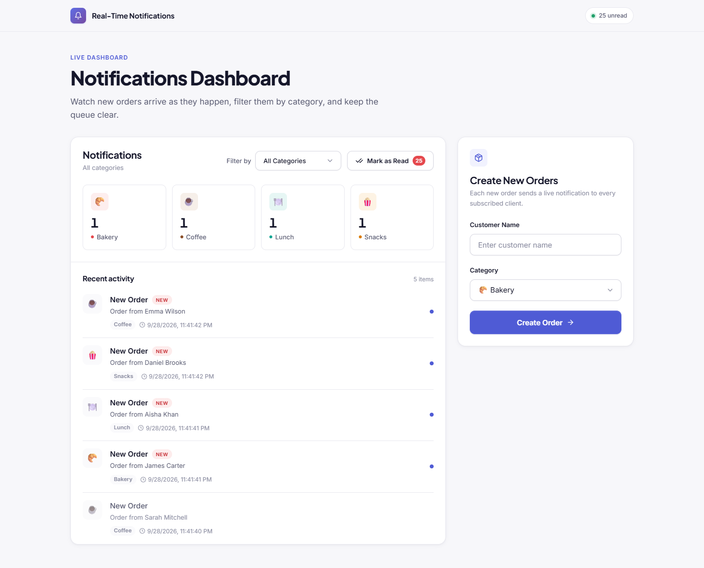
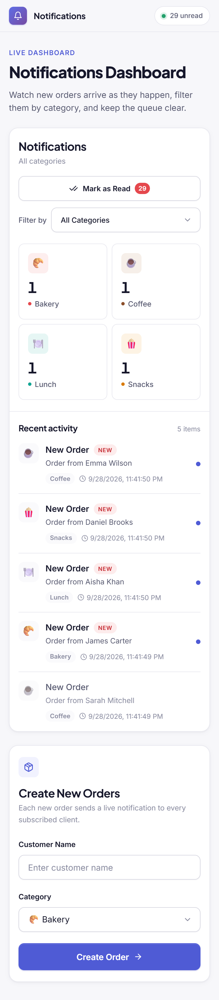

# Push Notifications Project

A real-time order notifications dashboard built with **ASP.NET Core SignalR** and **React + TypeScript**.
Orders created from the dashboard (or via the API) are pushed instantly to every connected client, grouped by food category, and can be marked as read individually, by category, or all at once.



<p align="center">
  
</p>

## Features

- **Live notifications** – new orders are broadcast over SignalR and appear instantly in *Recent activity*.
- **Browser notifications** – a system notification is shown when permission is granted.
- **Category overview** – unread counts for Bakery, Coffee, Lunch and Snacks; click a card to filter the feed.
- **Filter by category** – show all notifications or a single category.
- **Mark as read**
  - click an unread item in *Recent activity* to mark just that notification read
  - use **Mark as Read** to clear the selected category (or everything when *All Categories* is selected)
  - read state is synced to all open clients via SignalR
- **Create orders** – a simple form that posts a new order and triggers a notification.
- **Responsive UI** – works on desktop, tablet and mobile.

## Tech stack

| Layer    | Technology                                                   |
| -------- | ------------------------------------------------------------ |
| Backend  | ASP.NET Core (.NET 9) Web API, SignalR, EF Core, SQL Server  |
| Frontend | React 18, TypeScript, `@microsoft/signalr`, Axios            |
| Database | SQL Server (`sql/init.sql`)                                  |

## Project structure

```
├── backend/PushNotifications.Api   # ASP.NET Core API + SignalR hub
│   ├── Controllers/                # Orders & Notifications endpoints
│   ├── Hubs/NotificationHub.cs     # SignalR hub (/notificationHub)
│   └── Data/ Models/               # EF Core context and entities
├── frontend/                       # React + TypeScript client
│   ├── src/components/             # Dashboard UI
│   ├── src/contexts/               # Notification state + SignalR wiring
│   └── src/styles.css              # Design system / styles
├── sql/init.sql                    # Database schema + sample data
└── docs/screenshots/               # README images
```

## Getting started

### Prerequisites

- [.NET 9 SDK](https://dotnet.microsoft.com/download)
- [Node.js](https://nodejs.org/) 18+
- SQL Server (LocalDB, Express, or full)

### 1. Database

Run `sql/init.sql` against your SQL Server instance, then update the connection string in
`backend/PushNotifications.Api/appsettings.json` if needed.

### 2. Backend (http://localhost:5000)

```bash
cd backend/PushNotifications.Api
dotnet run --urls http://localhost:5000
```

### 3. Frontend (http://localhost:3001)

The API's CORS policy allows `http://localhost:3001`, so run the client on that port:

```bash
cd frontend
npm install

# PowerShell
$env:PORT=3001; npm start
# bash / macOS / Linux
PORT=3001 npm start
```

Open http://localhost:3001, allow browser notifications, and create an order.

## API

| Method | Endpoint                                         | Description                              |
| ------ | ------------------------------------------------ | ---------------------------------------- |
| POST   | `/api/orders`                                    | Create an order and broadcast `NewOrder` |
| GET    | `/api/orders/{id}`                               | Get an order                             |
| GET    | `/api/notifications`                             | List all notifications                   |
| GET    | `/api/notifications/count`                       | Unread notification count                |
| POST   | `/api/notifications/{id}/markRead`               | Mark one notification read               |
| POST   | `/api/notifications/markByCategory?category=...` | Mark a category read                     |
| POST   | `/api/notifications/markAllRead`                 | Mark all notifications read              |

### SignalR events (`/notificationHub`)

| Event                     | Payload                                  |
| ------------------------- | ---------------------------------------- |
| `NewOrder`                | `{ id, title, message, createdAt, payload, category }` |
| `NotificationMarkedRead`  | `{ id }`                                 |
| `NotificationsMarkedRead` | `{ category }` (empty = all)             |
